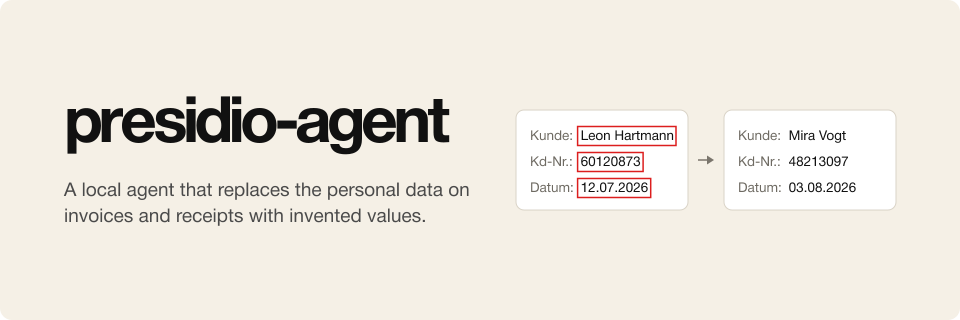

<p align="center">
  
</p>

# presidio-agent

presidio-agent is a local agent that replaces the personal data on invoices and receipts
with invented values. It makes synthetic copies of scanned images and PDFs in which every
name, address, account number, and date is new and consistent across pages, while every
other pixel of the original stays as it was. Each copy comes with an answer key, and the
work runs on one machine, so no document leaves it.

## Pipeline

[Presidio](https://github.com/microsoft/presidio)'s rule-based recognizers read each
page's text and flag candidates such as IBANs, card numbers, e-mail addresses, phone
numbers, and names. A vision model reads the page image and lists the values that are
personal, checking each candidate on the way. The agent, built on Hugging Face's
[Tau](https://github.com/huggingface/tau), then looks at the page image for each
candidate the model did not confirm and decides whether it belongs to a person or to the
business that issued the document.

Fixed code does the editing. It erases only the ink of each value and draws the new value in
the original size and colour, in a matching typeface. A barcode that encodes a changed
number is drawn again for the new number. Each copy is then read back, and the whole page is searched for every piece of
every original value. A copy that fails this leak check must not be used.

presidio-agent is an independent project. It is not affiliated with or endorsed by the
Presidio team.

## Install

You need Python 3.12+ and these programs:

- Tesseract with the German and English data (`tesseract-ocr`, `tesseract-ocr-deu`)
- poppler (`poppler-utils`) for PDFs
- the Liberation fonts (`fonts-liberation`); DejaVu (`fonts-dejavu-extra`) and the URW fonts (`fonts-urw-base35`) give closer matches
- a llama.cpp server (`llama-server`) running a vision model with its `--mmproj` projector

```sh
uv tool install git+https://github.com/osolmaz/presidio-agent.git
```

The install includes Presidio and the German spaCy model it uses for names. The model it
was built with is `prism-ml/Ternary-Bonsai-2-27B-gguf:PQ2_0` with its vision projector,
which fits a 16 GB GPU.

## Use

Start llama-server with the vision model on its default address, then run:

```sh
presidio-agent
```

and ask it, for example, to make two synthetic copies of `invoice.pdf`. A one-shot run
works too:

```sh
presidio-agent -p "Make two synthetic copies of invoice.pdf."
```

presidio-agent asks the server which model it serves. `--base-url` points it at a server
elsewhere, and `--model` picks one model on a router that serves several. Every other
option goes to Tau.

Next to Tau's own tools, the agent has three of its own. `find_personal_values` analyses
a document and `accept_value` adds a value the agent decided is personal, while
`make_copies` makes the copies and reports how each did in the leak check.

## Tool approval

Tools that write files or run commands ask before they run. The dialog shows the tool
and its input, with three choices:

```text
Allow once                        # run this call and keep asking for the next one
Allow all tools for this session  # run every tool call in this session without asking
Deny and stop                     # block the call and tell the agent to stop
```

Reading tools and presidio-agent's own three tools run without asking, because they
never change the documents; the own tools write only to the output and private folders.
`bash`, `write`, `edit`, and any other tool ask. A one-shot run with `-p` has nobody to
ask, so those calls are blocked there.

`--no-approval` turns the dialog off for one session, and `--approve-read-tools` adds the
reading tools to it. In a session, `/approval allow` or `/approval ask` changes the
setting for this and later sessions.

## Copies without the agent

For scripts, the `copy` command runs the fixed flow on its own:

```sh
presidio-agent copy invoice.pdf --n 3
presidio-agent copy scan.png --n 1 --no-presidio      # the vision model alone
python -m presidio_agent.page /dev/shm/presidio-agent/out   # a page to compare originals and copies
```

## Output

Copies go to the folder given with `--out`, by default `/dev/shm/presidio-agent/out` in RAM:

- `STEM.copy-K.pdf` and `STEM.copy-K.pN.png`, the copy as one PDF and page by page. A copy
  of a digital PDF is also an image, without a text layer.
- `STEM.copy-K.json`, the answer key with the new values only. It records each value's
  type, owner, and position with its read-back result, and each page's leak check.
- `STEM.pN.original.png` and `STEM.pN.boxes.png`, each page and the values found on it.

Everything that holds the original personal data goes to `--private`, by default
`/dev/shm/presidio-agent/private`. That covers the analysis with Presidio's candidates,
the old-to-new mappings, and the agent's session logs. Do not serve or commit that folder.

## Limits

- A value that neither Presidio nor the vision model finds is not replaced. Check
  `STEM.pN.boxes.png`, and use only copies whose leak check passed.
- Amounts and line items stay unchanged, so the totals still add up.
- QR codes are not handled yet.
- The redraw uses common Linux fonts, so a very different typeface will look different.

## License

MIT. Presidio and Tau are MIT-licensed as well.
